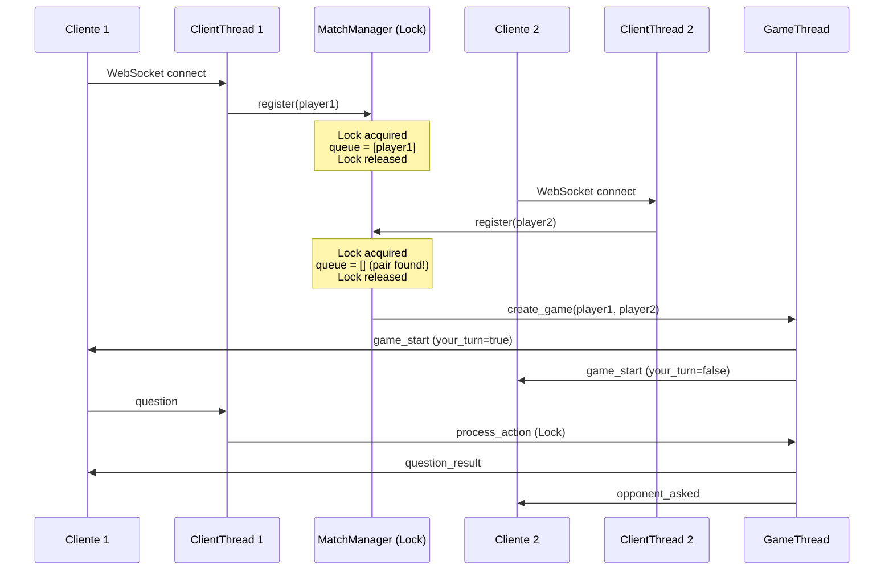

# Adivina Quién — Juego Multijugador con Hilos y Sockets

## Objetivo

Implementar el juego "Adivina Quién" multijugador usando **Python con sockets crudos (`socket`) y hilos (`threading`)**. El cliente será una interfaz web (HTML/CSS/JS) que se conecta al servidor mediante **WebSocket implementado manualmente sobre sockets TCP crudos** — sin librerías externas de WebSocket.

## Stack Tecnológico

| Componente | Tecnología | Justificación |
|---|---|---|
| Servidor | Python 3.10+ | `socket` + `threading` — cumple requisito obligatorio |
| Protocolo | WebSocket sobre TCP crudo | Demuestra manejo real de sockets + permite cliente web |
| Cliente | HTML5 + CSS3 + JavaScript vanilla | UI premium, sin dependencias |
| Concurrencia | `threading.Thread` + `threading.Lock` | Un hilo por conexión + un hilo por partida |

> [!IMPORTANT]
> **Sockets**: Se usa `socket.socket(AF_INET, SOCK_STREAM)` directamente. El handshake y framing de WebSocket se implementan manualmente con `hashlib.sha1`, `struct`, y operaciones bitwise.
>
> **Hilos**: Cada conexión de cliente corre en su propio `threading.Thread`. Cada partida activa corre en un `GameThread`. El estado compartido se protege con `threading.Lock`.

---

## Arquitectura

```mermaid
graph TB
    subgraph "Servidor Python"
        MS["Main Thread<br/>socket.bind() + listen()"]
        MS -->|accept()| CT1["ClientThread #1"]
        MS -->|accept()| CT2["ClientThread #2"]
        MS -->|accept()| CT3["ClientThread #3"]
        MS -->|accept()| CT4["ClientThread #4"]
        
        MM["MatchManager<br/>(threading.Lock)"]
        CT1 -->|register| MM
        CT2 -->|register| MM
        CT3 -->|register| MM
        CT4 -->|register| MM
        
        MM -->|pair| GT1["GameThread #1<br/>(Player 1 + 2)"]
        MM -->|pair| GT2["GameThread #2<br/>(Player 3 + 4)"]
        
        GS["GameState<br/>(per-game, thread-safe)"]
        GT1 --> GS
        GT2 --> GS
    end
    
    subgraph "Clientes Web"
        B1["Browser 1"] <-->|WebSocket| CT1
        B2["Browser 2"] <-->|WebSocket| CT2
        B3["Browser 3"] <-->|WebSocket| CT3
        B4["Browser 4"] <-->|WebSocket| CT4
    end
    
    subgraph "HTTP Server Thread"
        HS["Serve static files<br/>(index.html, css, js)"]
    end
```

---

## Estructura de Archivos

```
DYPFINAL/
├── server.py              # Servidor principal: socket + threading
├── websocket_handler.py   # Implementación WebSocket sobre socket crudo
├── game_logic.py          # Lógica del juego: tablero, personajes, turnos
├── characters.py          # Definición de los 24 personajes y atributos
├── public/
│   ├── index.html         # Interfaz del juego
│   ├── css/
│   │   └── style.css      # Estilos premium
│   └── js/
│       └── app.js         # Lógica del cliente WebSocket
├── requirements.txt       # Sin dependencias externas (stdlib only)
└── README.md              # Documentación completa
```

---

## Proposed Changes

### Capa de Sockets y WebSocket

#### [NEW] [websocket_handler.py](file:///c:/Users/juan_/OneDrive/Documents/PROYECTOS/DYPFINAL/websocket_handler.py)

Implementación manual del protocolo WebSocket sobre `socket`:
- **Handshake HTTP Upgrade**: Parsear la request HTTP del browser, calcular `Sec-WebSocket-Accept` con SHA-1 + base64
- **Frame encoding**: Construir frames WebSocket (opcode, payload length, masking)
- **Frame decoding**: Leer frames del cliente (siempre masked), decodificar payload
- **Ping/Pong**: Mantener conexión viva
- **Close handshake**: Cierre limpio de conexión

Usa SOLO: `socket`, `hashlib`, `base64`, `struct`

---

### Servidor Principal

#### [NEW] [server.py](file:///c:/Users/juan_/OneDrive/Documents/PROYECTOS/DYPFINAL/server.py)

- **Main Thread**: `socket.socket()` → `bind()` → `listen()` → loop de `accept()`
- **HTTP Handler Thread**: Sirve archivos estáticos (HTML/CSS/JS) por HTTP
- **ClientThread**: Un `threading.Thread` por cada conexión aceptada
  - Realiza handshake WebSocket
  - Registra al jugador en `MatchManager`
  - Procesa mensajes entrantes del cliente
- **MatchManager**: Cola de espera thread-safe con `threading.Lock`
  - Cuando hay 2 jugadores, crea un `GameThread`
- **GameThread**: `threading.Thread` que ejecuta una partida
  - Maneja turnos alternados
  - Valida acciones (preguntas, adivinanzas)
  - Determina victoria
  - Notifica a ambos jugadores

---

### Lógica del Juego

#### [NEW] [characters.py](file:///c:/Users/juan_/OneDrive/Documents/PROYECTOS/DYPFINAL/characters.py)

24 personajes con atributos binarios/categóricos:

| Atributo | Valores posibles |
|---|---|
| `gender` | male, female |
| `hair_color` | black, brown, blonde, red, white, none |
| `hair_type` | straight, curly, bald |
| `eye_color` | brown, blue, green |
| `has_glasses` | true, false |
| `has_hat` | true, false |
| `has_beard` | true, false |
| `has_mustache` | true, false |
| `skin_tone` | light, medium, dark |

#### [NEW] [game_logic.py](file:///c:/Users/juan_/OneDrive/Documents/PROYECTOS/DYPFINAL/game_logic.py)

- `GameState`: Estado completo de una partida
  - Tablero de 24 personajes (mismo para ambos jugadores)
  - Personaje secreto de cada jugador (diferentes entre sí)
  - Turno actual
  - Personajes eliminados por cada jugador
  - Historial de preguntas
- Validación de preguntas contra atributos válidos
- Lógica de respuesta (SI/NO basado en atributo del personaje secreto rival)
- Detección de victoria (adivinanza correcta)

---

### Cliente Web

#### [NEW] [index.html](file:///c:/Users/juan_/OneDrive/Documents/PROYECTOS/DYPFINAL/public/index.html)

- Pantalla de espera (matchmaking) con animación
- Tablero de 24 personajes en grid 6×4
- Panel de preguntas con selector de atributo + valor
- Indicador de turno
- Historial de preguntas/respuestas
- Modal de victoria/derrota

#### [NEW] [style.css](file:///c:/Users/juan_/OneDrive/Documents/PROYECTOS/DYPFINAL/public/css/style.css)

- Dark theme con glassmorphism
- Paleta: deep purple (#6C3CE1) + cyan (#00D4FF) + dark (#0D0D1A)
- Cards con flip animation al eliminar personajes
- Transiciones suaves en todos los elementos interactivos
- Responsive (mobile-friendly)
- Google Fonts: Inter

#### [NEW] [app.js](file:///c:/Users/juan_/OneDrive/Documents/PROYECTOS/DYPFINAL/public/js/app.js)

- Conexión WebSocket al servidor
- Renderizado dinámico del tablero
- Gestión de estados de UI (waiting → playing → game_over)
- Envío de preguntas y adivinanzas
- Animaciones de eliminación de personajes
- Notificaciones de turno

---

### Documentación

#### [NEW] [README.md](file:///c:/Users/juan_/OneDrive/Documents/PROYECTOS/DYPFINAL/README.md)

- Descripción del proyecto
- Arquitectura (diagrama)
- Requisitos e instalación
- Cómo ejecutar
- Protocolo de comunicación
- Explicación de hilos y sockets

---

## Protocolo de Comunicación (JSON sobre WebSocket)

### Cliente → Servidor
```json
{"type": "question", "attribute": "hair_color", "value": "red"}
{"type": "guess", "name": "Carlos"}
{"type": "toggle", "name": "Maria"}
```

### Servidor → Cliente
```json
{"type": "waiting"}
{"type": "game_start", "board": [...], "your_turn": true, "player_number": 1}
{"type": "question_result", "question": "¿Tiene pelo rojo?", "answer": true, "your_turn": false}
{"type": "opponent_asked", "question": "¿Tiene lentes?", "your_turn": true}
{"type": "guess_result", "correct": true, "secret": "Carlos"}
{"type": "game_over", "winner": true, "opponent_secret": "Maria", "your_secret": "Carlos"}
{"type": "opponent_disconnected"}
```

---

## Mecánica de Turnos

1. Servidor asigna turno al Jugador 1 al inicio
2. En su turno, el jugador puede:
   - **Preguntar**: Selecciona atributo + valor → Servidor responde SI/NO
   - **Adivinar**: Nombra un personaje → Si acierta, gana. Si falla, pierde.
3. Después de una pregunta, el turno pasa al otro jugador
4. El jugador puede eliminar personajes de su tablero en cualquier momento (gestión local)

---

## Concurrencia y Thread Safety



---

## Verification Plan

### Automated Tests

```bash
# 1. Iniciar el servidor
python server.py

# 2. Abrir dos pestañas del navegador en http://localhost:8080
# 3. Verificar matchmaking automático
# 4. Jugar una partida completa
```

### Manual Verification

1. **Matchmaking**: Abrir 4 pestañas → deben formarse 2 partidas independientes
2. **Turnos**: Verificar que solo el jugador activo puede actuar
3. **Preguntas**: Verificar respuestas correctas contra el personaje secreto
4. **Adivinanza correcta**: Verificar victoria
5. **Adivinanza incorrecta**: Verificar derrota
6. **Desconexión**: Cerrar una pestaña → el otro jugador debe ser notificado
7. **Concurrencia**: 2+ partidas simultáneas sin interferencia

